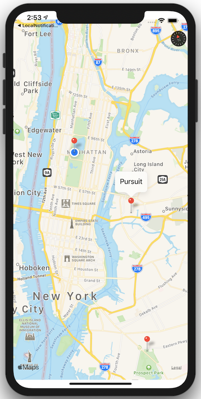

# CoreLocation Introduction

Introduction to CoreLocation and MapKit.



## 1. Create a strong reference to a CLLocationManager

It's highly recommended that we keep a strong reference to a CLLocationManager in our app.

```swift 
/*
 https://developer.apple.com/documentation/corelocation/adding_location_services_to_your_app
 Create an instance of the CLLocationManager class and store a strong reference to it somewhere in your app.
 You must keep a strong reference to the location manager object until all tasks involving that object complete.
 Because most location manager tasks run asynchronously, storing your location manager in a local variable is insufficient.
*/

public var locationManager: CLLocationManager
```

## 2. Request location permissions 

Required keys to include in the info.plist are: 
1. NSLocationAlwaysAndWhenInUseUsageDescription
2. NSLocationWhenInUseUsageDescription

```swift 
private func requestLocationPersmissions() {
  /*
    This app has attempted to access privacy-sensitive data without a usage description.
    The app's Info.plist must contain both “NSLocationAlwaysAndWhenInUseUsageDescription”
    and “NSLocationWhenInUseUsageDescription” keys with string values explaining to the user how the app uses this data
  */
  //CLLocationManager().requestWhenInUseAuthorization()

  locationManager.requestAlwaysAuthorization()
  locationManager.requestWhenInUseAuthorization()  
}
```

## 3. Set a custom object as the CLLocationManager delegate 

```swift 
locationManager.delegate = self    
```

## 4. didChangeAuthorization method on the CLLocationManagerDelegate which listens for updates for changes to the location authorization status

```swift 
func locationManager(_ manager: CLLocationManager, didChangeAuthorization status: CLAuthorizationStatus) {
  print("didChangeAuthorization")
  switch status {
  case .authorizedAlways:
    print("authorizedAlways")
  case .authorizedWhenInUse:
    print("authorizedWhenInUse")
  case .denied:
    print("denied")
  case .notDetermined:
    print("notDetermined")
  case .restricted:
    print("restricted")
  default:
    break
  }
}
```

## 5. didUpdateLocations protocol method on CLLocationManageDelegate listens for user location changes

```swift 
func locationManager(_ manager: CLLocationManager, didUpdateLocations locations: [CLLocation]) {
  print("didUpdateLocations: \(locations)")
}
```

## 6. Getting user location. 

#### Standard location service. Ideal for navigation apps.

To start the standard location service, configure your CLLocationManager object and call its startUpdatingLocation() method.

```swift 
locationManager.startUpdatingLocation()

/*
 When you no longer need location data, always call your location manager object's stopUpdatingLocation() method.
 If you do not stop location updates, the system continues delivering location data to your app, which could cause
 significant battery drain for the user's device.
*/
```

Saving power with desiredAccuracy 

```swift 
locationManager.desiredAccuracy = kCLLocationAccuracyKilometer // power savings switch to wifi vs GPS when available
```

#### Significant-change location service. More power efficient and less updates.

```swift 
startSignificantLocationChanges()
```

```swift 
private func startSignificantLocationChanges() {
  if !CLLocationManager.significantLocationChangeMonitoringAvailable() {
    print("The device does not support this service")
    return
  }
  locationSession.locationManager.startMonitoringSignificantLocationChanges()
}
```


## 7. Start monitoring a region

```swift 
private func startMonitoringRegion() {
  let location = Location.getLocations()[2] // central park
  let identifier = "monitoring region"
  let region = CLCircularRegion(center: location.coordinate, radius: 500, identifier: identifier)
  region.notifyOnEntry = true
  region.notifyOnExit = false

  locationManager.startMonitoring(for: region)
}
```

## 8. Stop monitoring a region

```swift 
private func stopMonitoringRegion() {
  let location = Location.getLocations()[2] // central park
  let identifier = "monitoring region"
  let region = CLCircularRegion(center: location.coordinate, radius: 500, identifier: identifier)
  region.notifyOnEntry = true
  region.notifyOnExit = false

  locationManager.stopMonitoring(for: region)
}
```

## 9. Convert CLLocationCoordinate2D to CLPlacemark

```swift 
public func convertCoordinateToPlacemark(coordinate: CLLocationCoordinate2D) {
  // we will use the CLGeocoder() class for converting coordinate (CLLocationCoordinate2D) to placemark (CLPlacemark)

  // we need to create CLLocation
  let location = CLLocation(latitude: coordinate.latitude, longitude: coordinate.longitude)

  CLGeocoder().reverseGeocodeLocation(location) { (placemarks, error) in
    if let error = error {
      print("reverseGeocodeLocation: \(error)")
    }
    if let firstPlacemark = placemarks?.first {
      print("placemark info: \(firstPlacemark)")
    }
  }
}
```

## 10. Convert CLPlacemark to CLLocationCoordinate2D

```swift 
public func convertPlaceNameToCoordinate(addressString: String) {
  // coverting an address to a coordinate
  CLGeocoder().geocodeAddressString(addressString) { (placemarks, error) in
    if let error = error {
      print("geocodeAddressString: \(error)")
    }
    if let firstPlacemark = placemarks?.first,
      let location = firstPlacemark.location {
      print("place name coordinate is \(location.coordinate)")
    }
  }
}
```

## 11. Placemarks 

```swift 
extension CoreLocationSession {
  public func getPostalCode(completion: @escaping (Result<String, LocationError>) -> ()) {
    guard let location = locationManager.location else {
      return
    }
    CLGeocoder().reverseGeocodeLocation(location) { (placemarks, error) in
      guard error == nil,
            let placemark = placemarks?.first else {
        if let error = error {
          completion(.failure(.geocodingError(error)))
        }
        completion(.failure(.unknown))
        return
      }
      print(placemark)
      
      print(placemark.administrativeArea)
      print(placemark.areasOfInterest)
      print(placemark.locality)
      print(placemark.name)
      
      print(placemark.subAdministrativeArea)
      print(placemark.subLocality)
      print(placemark.subThoroughfare)
      
      print(placemark.thoroughfare)
      
      print(placemark.postalCode)
      
      print(placemark.region)
      
      print(placemark.location)
      
      guard let postalCode = placemark.postalCode else {
        completion(.failure(.noPostalCode))
        return
      }
      
      completion(.success(postalCode))
    }
  }
}
```


# MapKit Introduction

## 1. Show the user's current location

```swift 
// attempt to show the user's current location
mapView.showsUserLocation = true
```

## 2. Make annotations 

```swift 
private func makeAnnotations() -> [MKPointAnnotation] {
  var annotations = [MKPointAnnotation]()
  for location in Location.getLocations() {
    let annotation = MKPointAnnotation()
    annotation.coordinate = location.coordinate
    annotation.title = location.title
    annotations.append(annotation)
  }
  return annotations
}
```

## 3. Add annotations to map view 

```swift 
private func loadMapView() {
  let annotations = makeAnnotations()
  mapView.showAnnotations(annotations, animated: true)
}
```

